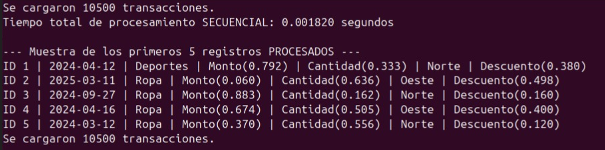
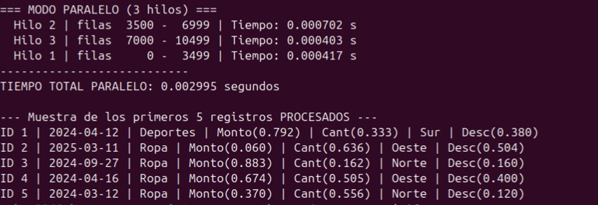
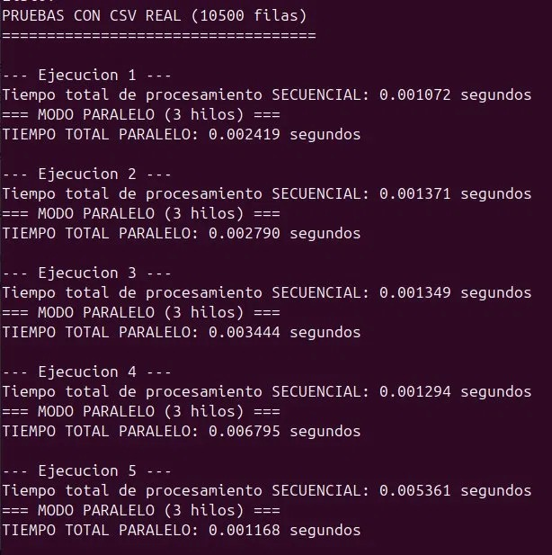
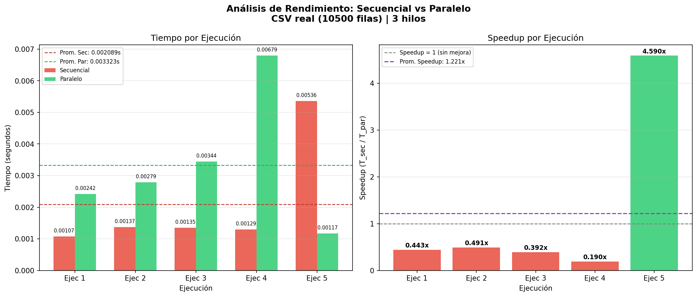

# Procesamiento Paralelo de Transacciones de Ventas

**Escuela Politécnica Nacional — Facultad de Ingeniería en Sistemas (FIS)**  
**Materia:** Sistemas Operativos  
**Grupo:** F
**Docente:** PhD. Silvia Diana Martínez Mosquera  
**Año:** 2026

---

## Descripción del Problema

Este proyecto implementa en lenguaje C el procesamiento paralelo de un dataset real de transacciones de ventas (`transacciones_real.csv`) con **10,500 filas y 7 columnas**, ejecutado en una máquina virtual Ubuntu.

El objetivo es comparar el rendimiento entre dos modos de ejecución:

- **Modo secuencial:** un solo hilo (`main`) procesa todo el dataset de forma lineal.
- **Modo paralelo:** 3 hilos (`pthread`) procesan bloques independientes del dataset en simultáneo.

Cada modo aplica tres operaciones de limpieza y transformación sobre los datos:

1. **Limpieza de nulos numéricos:** reemplaza los valores faltantes (`-1.0f`) con el promedio del campo correspondiente.
2. **Imputación de moda categórica:** rellena los campos de texto vacíos con el valor más frecuente (moda).
3. **Normalización min-max:** escala los valores numéricos al rango `[0, 1]` usando la fórmula `(valor - min) / (max - min)`.

---

## Dataset: `transacciones_real.csv`

| Campo | Tipo | Valores posibles | Nulos |
|---|---|---|---|
| id_transaccion | Entero secuencial | — | 0% |
| fecha | String `YYYY-MM-DD` | — | 0% |
| categoria | String | Electrónica, Ropa, Alimentos, Hogar, Deportes | 14.87% (1,561 filas) |
| monto | Float | 1.30 – 9,999.07 | 9.61% (1,009 filas) |
| cantidad | Entero | 1 – 100 | 7.77% (816 filas) |
| region | String | Norte, Sur, Centro, Este, Oeste | 12.35% (1,297 filas) |
| descuento | Float | 0.00 – 0.50 | 9.95% (1,045 filas) |

> Total de celdas vacías: **5,728** distribuidas en 5 columnas.

---

## Estructura del Proyecto

```
.
├── transacciones.h       # Estructura Transaccion con los 7 campos
├── leer_csv.h            # Declaraciones de lectura del CSV
├── leer_csv.c            # Lectura línea por línea, parseo y marcado de nulos con -1.0f
├── procesamiento.h       # Declaraciones de las funciones de procesamiento
├── procesamiento.c       # limpiar_nulos_numericos(), imputar_moda_categoricos(), normalizar()
├── main_seq.c            # Ejecución secuencial con medición de tiempo
├── paralelo.c            # Ejecución paralela con 3 hilos pthread
├── transacciones_real.csv
├── grafico_rendimiento.png
└── README.md
└── Cap1.png         #imagenes de ejecucion
└── Cap2.png         #imagenes de ejecucion
└── Cap3.jpeg         #imagenes de ejecucion
```
```
```

---

## Requisitos

- Sistema operativo: **Ubuntu** (probado en VM)
- Compilador: `gcc`
- Biblioteca: `pthread.h` (incluida en Linux por defecto)
- Python 3 + matplotlib + numpy (solo para generar el gráfico)

---

## Procedimiento de Compilación y Ejecución

### 1. Clonar el repositorio

```bash
git clone https://github.com/tu-usuario/tu-repositorio.git
cd tu-repositorio
```

### 2. Compilar modo secuencial

```bash
gcc -o main_seq main_seq.c leer_csv.c procesamiento.c -lm
```

### 3. Compilar modo paralelo

```bash
gcc -o paralelo paralelo.c leer_csv.c procesamiento.c -pthread -lm
```

### 4. Ejecutar modo secuencial

```bash
./main_seq transacciones_real.csv
```

**Salida esperada:**
```
Se cargaron 10500 transacciones.
Tiempo total de procesamiento SECUENCIAL: 0.001820 segundos

--- Muestra de los primeros 5 registros PROCESADOS ---
ID 1 | 2024-04-12 | Deportes | Monto(0.792) | Cantidad(0.333) | Norte | Descuento(0.380)
```
**Imagenes Ejecucion**


### 5. Ejecutar modo paralelo

```bash
./paralelo transacciones_real.csv
```

**Salida esperada:**
```
Se cargaron 10500 transacciones.

=== MODO PARALELO (3 hilos) ===
  Hilo 2 | filas  3500 -  6999 | Tiempo: 0.000702 s
  Hilo 3 | filas  7000 - 10499 | Tiempo: 0.000403 s
  Hilo 1 | filas     0 -  3499 | Tiempo: 0.000417 s
---------------------------
TIEMPO TOTAL PARALELO: 0.002995 segundos
```
**Imagenes Ejecucion**



> **Nota:** El orden de finalización de los hilos (2 → 3 → 1) es variable en cada ejecución, lo que confirma que la ejecución es verdaderamente concurrente.

### 6. Generar el gráfico de rendimiento 

```bash
python3 grafico.py
```

---

## Resultados

Se realizaron **5 ejecuciones** de cada modo con el dataset completo de 10,500 filas:

| Ejecución | Secuencial (s) | Paralelo (s) | Speedup | Eficiencia |
|:---------:|:--------------:|:------------:|:-------:|:----------:|
| 1 | 0.001072 | 0.002419 | 0.443x | 0.148 |
| 2 | 0.001371 | 0.002790 | 0.491x | 0.164 |
| 3 | 0.001349 | 0.003444 | 0.392x | 0.131 |
| 4 | 0.001294 | 0.006795 | 0.190x | 0.063 |
| 5 ⚠ | 0.005361 | 0.001168 | 4.590x | 1.530 |
| **Promedio total** | **0.002089** | **0.003323** | **1.221x** | **0.407** |
| **Promedio sin ejec. 5** | **0.001272** | **0.003862** | **0.379x** | **0.126** |

**Imagenes Ejecucion**


> **⚠ Ejecución 5:** El tiempo secuencial de 0.005361 s es anómalo. El SO realizó un **context switch** sobre el hilo principal durante esa medición, pausándolo para atender otro proceso. Esto elevó artificialmente el tiempo de ~0.001 s a 0.005361 s, generando un speedup de 4.590x que no refleja una ventaja real del paralelismo.

**Fórmulas:**
```
Speedup    = T_secuencial / T_paralelo
Eficiencia = Speedup / N° hilos (3)
```



---

## Conclusiones

**1. Speedup real de 0.379x en condiciones normales**  
Descartando la ejecución 5, el paralelo fue más lento en 4 de 5 mediciones. El promedio general de 1.221x está inflado por el context switch del SO en esa ejecución. Esto no es un error del código — es el comportamiento normal de un sistema operativo multitarea.

**2. El overhead de pthread domina con 10,500 filas**  
El costo fijo de `pthread_create()` y `pthread_join()` supera el beneficio de dividir el trabajo en datasets de este tamaño. El paralelo solo "ganó" cuando el SO penalizó externamente al hilo secuencial, no por mérito del paralelismo.

**3. Sincronización correcta y ejecución verdaderamente concurrente**  
El `mutex` garantizó acceso exclusivo al `printf` sin condiciones de carrera. Los bloques de datos son completamente independientes entre hilos, por lo que no se necesitaron locks durante el procesamiento. El orden de finalización variable confirma ejecución en paralelo real.

**4. Escalabilidad favorable con datasets mayores**  
Con 100,000+ filas, el overhead fijo de crear los hilos sería insignificante. La Ley de Amdahl proyecta un speedup cercano a **3x** con 3 hilos en esas condiciones.

---

## Mecanismos de Sincronización

```c
pthread_mutex_t mutex = PTHREAD_MUTEX_INITIALIZER;

// Protege la impresión de resultados por consola
pthread_mutex_lock(&mutex);
printf("Hilo %d | filas %d - %d | Tiempo: %.6f s\n", ...);
pthread_mutex_unlock(&mutex);
```

Los bloques de datos asignados a cada hilo son disjuntos (sin superposición), por lo que el mutex solo es necesario al momento de imprimir — no durante el procesamiento de los datos.